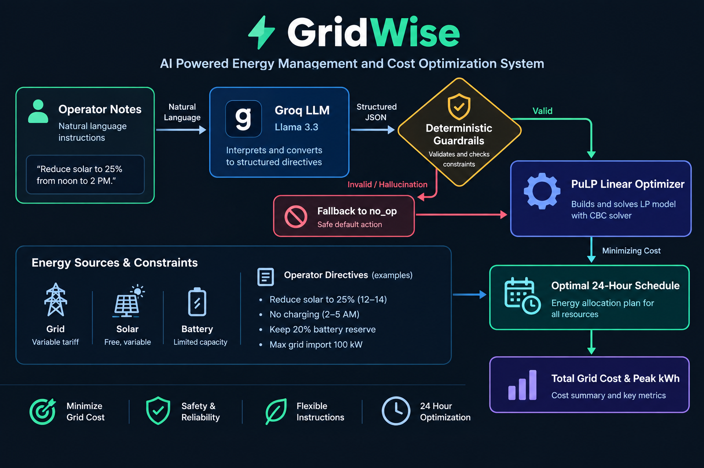

<div align="center">

# GridWise

### AI Powered Energy Management and Cost Optimization System

<p>
  <strong>Natural language operator instructions to optimal 24 hour energy schedules.</strong>
</p>

<p>
  <a href="https://gridwise-semicolons.onrender.com/health">
    
  </a>
  <a href="https://gridwise-semicolons.onrender.com/docs">
    
  </a>
  <a href="https://github.com/nomancsediu/BUP_CSE_FEST_2026_Semicolons_GridWise">
    
  </a>
  
  
  
  
  
</p>

<p>
  <a href="#overview">Overview</a> ·
  <a href="#architecture">Architecture</a> ·
  <a href="#optimization-model">Optimization Model</a> ·
  <a href="#api">API</a> ·
  <a href="#quick-start">Quick Start</a>
</p>

</div>

---

<div align="center">

## Overview

</div>

GridWise is an AI powered Energy Management System designed to minimize the total financial cost of electricity imported from the national grid over a 24 hour operating cycle.

The system manages three energy sources:

<div align="center">

| Source      | Description                                                         |
| ----------- | ------------------------------------------------------------------- |
| **Grid**    | Unlimited electricity with time varying tariffs                     |
| **Solar**   | Free energy with forecast dependent availability                    |
| **Battery** | Energy storage that can charge and discharge within physical limits |

</div>

The objective is to satisfy the facility's hourly energy demand while minimizing grid electricity cost and respecting battery, solar, and operational constraints.

GridWise also allows operators to describe operational restrictions using natural language. For example:

```text
Reduce solar to 25% from noon to 2 PM.
```

The system converts this instruction into a structured constraint, validates it, and incorporates it into the optimization model.

---

<div align="center">

## Architecture

</div>

<div align="center">



</div>

The architecture consists of three primary stages.

### 1. LLM Interpretation

GridWise uses **Qwen 3.8 27B through Groq** to convert natural language operator notes into structured JSON directives.

For example:

**Operator Note**

```text
Reduce solar to 25% from noon to 2 PM.
```

**Interpreted Directive**

```json
{
  "type": "solar_reduction",
  "hours": [12, 13],
  "factor": 0.25
}
```

Supported directive types include:

| Directive                 | Description                                             |
| ------------------------- | ------------------------------------------------------- |
| `solar_reduction`         | Limits usable solar energy                              |
| `minimum_battery_reserve` | Maintains a minimum battery energy level                |
| `no_charge_window`        | Prevents battery charging during selected hours         |
| `no_discharge_window`     | Prevents battery discharging during selected hours      |
| `max_grid_window`         | Limits grid import during selected hours                |
| `no_op`                   | Represents an irrelevant or non operational instruction |

### 2. Deterministic Guardrails

LLM generated directives are never passed directly to the optimization engine.

The guardrail layer validates every directive against deterministic rules.

Validation includes:

* Hour values must be between `0` and `23`
* Numeric factors must be within valid ranges
* Battery constraints must be physically possible
* Directive types must be supported
* Constraint values must be compatible with the scenario

For example, if the LLM generates:

```json
{
  "type": "solar_reduction",
  "hours": [12, 25],
  "factor": 0.25
}
```

the directive is invalid because hour `25` does not exist in a 24 hour cycle.

The system rejects the invalid directive or converts it to `no_op` rather than allowing invalid data to affect the optimization model.

### 3. Linear Programming

Validated constraints are passed to the optimization engine implemented using **PuLP with the CBC solver**.

The optimizer determines the hourly values for:

```text
Grid Import
Solar Usage
Battery Charge
Battery Discharge
Battery Energy Level
```

The objective is to minimize the total cost of grid electricity.

---

<div align="center">

## Optimization Model

</div>

### Objective Function

The total grid electricity cost is:

$$ \min \sum_{h=0}^{23} Grid_h \times Tariff_h $$

where:

* `Grid_h` is the grid electricity imported during hour `h`
* `Tariff_h` is the grid electricity price during hour `h`

The optimizer minimizes this value while maintaining a feasible energy schedule.

### Energy Balance

For every hour:

$$ Grid_h + Solar_h + Discharge_h = Demand_h + Charge_h $$

This ensures that the facility's energy demand is satisfied while accounting for battery charging.

### Battery Constraints

The model enforces:

* Battery capacity
* Minimum battery energy
* Maximum charging rate
* Maximum discharging rate
* Operator defined reserve requirements
* Charging restrictions
* Discharging restrictions

### End of Day Neutrality

The battery must finish the 24 hour cycle at the same energy level at which it started.

$$
Battery_{23} = Battery_{initial}
$$

For example, if the battery starts with `100 kWh`, the optimized schedule must end with `100 kWh`.

This prevents the optimizer from reducing the calculated cost simply by exhausting the battery before the end of the cycle.

---

<div align="center">

## Complete Example

</div>

Suppose the system receives the following operator instruction:

```text
Reduce solar to 25% from noon to 2 PM.
```

The LLM produces:

```json
{
  "type": "solar_reduction",
  "hours": [12, 13],
  "factor": 0.25
}
```

The guardrail layer validates the directive.

If the solar forecast at hour 12 is:

```text
80 kWh
```

the optimizer can use at most:

$$
80 \times 0.25 = 20\text{ kWh}
$$

of solar during that hour.

The optimizer then considers this restriction together with:

```text
Hourly demand
Solar forecast
Grid tariffs
Battery capacity
Initial battery energy
Minimum battery energy
Charge rate
Discharge rate
Other operator directives
End of day neutrality
```

It evaluates the complete 24 hour scenario and generates the lowest cost feasible schedule.

---

<div align="center">

## Input and Output

</div>

### Input

The `/optimize-energy` endpoint accepts:

```json
{
  "scenario_id": "TEST-01",
  "operator_notes": [
    "Reduce solar to 25% from noon to 2 PM"
  ],
  "hours": [
    {
      "hour": 0,
      "demand_kwh": 100,
      "solar_kwh": 0,
      "tariff_bdt_per_kwh": 6
    }
  ],
  "battery": {
    "capacity_kwh": 200,
    "initial_energy_kwh": 100,
    "minimum_energy_kwh": 40,
    "max_charge_kwh_per_hour": 50,
    "max_discharge_kwh_per_hour": 50
  }
}
```

The `hours` array must contain 24 hourly records.

### Output

The endpoint returns the interpreted directives, optimization status, detailed hourly schedule, total grid import, total cost, and battery state information.

Example:

```json
{
  "status": "optimal",
  "total_grid_import_kwh": 720,
  "total_cost_bdt": 6840,
  "initial_battery_kwh": 100,
  "final_battery_kwh": 100,
  "schedule": [
    {
      "hour": 0,
      "grid_kwh": 40,
      "solar_kwh": 0,
      "charge_kwh": 0,
      "discharge_kwh": 0,
      "battery_kwh": 100
    }
  ]
}
```

The actual schedule depends on the supplied scenario data.

---

<div align="center">

## API

</div>

### Health Check

```http
GET /health
```

Response:

```json
{
  "status": "ok"
}
```

### Energy Optimization

```http
POST /optimize-energy
```

The endpoint accepts the complete 24 hour scenario and returns the optimized energy schedule.

### Public Deployment
The API is deployed and accessible at: [https://gridwise-semicolons.onrender.com](https://gridwise-semicolons.onrender.com)
Interactive documentation: [https://gridwise-semicolons.onrender.com/docs](https://gridwise-semicolons.onrender.com/docs)

---


<div align="center">

## 🛠️ Technology Stack

### Core Engine
  

### AI & Intelligence
 

### Math & Optimization
 

### Infrastructure & DevOps
 

</div>

| Layer | Component | Purpose |
| :--- | :--- | :--- |
| **API Layer** | `FastAPI` | High-performance asynchronous request handling |
| **Intelligence** | `Qwen 3.8 27B` | Parsing natural language into structured JSON |
| **Control** | `Pydantic` | Strict type validation and deterministic guardrails |
| **Optimization** | `PuLP` | Solving the Linear Programming cost minimization problem |
| **Solver** | `CBC` | The underlying mathematical solver for LP |
| **Packaging** | `Docker` | Ensuring consistent environment across all platforms |

---

## Project Structure

```text
GridWise/
│
├── main.py
├── models.py
├── interpreter.py
├── guardrails.py
├── optimizer.py
├── requirements.txt
├── Dockerfile
└── docs/
    └── architecture.png
```

| File                    | Description                              |
| ----------------------- | ---------------------------------------- |
| `main.py`               | API routes and application orchestration |
| `models.py`             | Pydantic data models                     |
| `interpreter.py`        | LLM based operator note interpretation   |
| `guardrails.py`         | Deterministic validation layer           |
| `optimizer.py`          | PuLP Linear Programming implementation   |
| `requirements.txt`      | Python dependencies                      |
| `Dockerfile`            | Docker configuration                     |
| `docs/architecture.png` | System architecture diagram              |

---

<div align="center">

## Quick Start

</div>

### Clone

```bash
git clone https://github.com/nomancsediu/BUP_CSE_FEST_2026_Semicolons_GridWise.git

cd BUP_CSE_FEST_2026_Semicolons_GridWise
```

### Install Dependencies

```bash
pip install -r requirements.txt
```

### Configure Environment

Create a `.env` file in the project root:

```env
GROQ_API_KEY=your_groq_api_key_here
```

### Run the API

```bash
uvicorn main:app --host 0.0.0.0 --port 8000
```

The API will be available at:

```text
http://localhost:8000
```

Interactive documentation:

```text
http://localhost:8000/docs
```

---

<div align="center">

## Docker

</div>

GridWise can be deployed using Docker.

### Build

```bash
docker build -t gridwise-optimizer .
```

### Run

```bash
docker run -p 8000:8000 \
  -e GROQ_API_KEY=your_api_key_here \
  gridwise-optimizer
```

### Docker Hub

Available image:

```text
abdnoman/gridwise-optimizer:v1.0
```

Pull:

```bash
docker pull abdnoman/gridwise-optimizer:v1.0
```

Run:

```bash
docker run -p 8000:8000 \
  -e GROQ_API_KEY=your_api_key_here \
  abdnoman/gridwise-optimizer:v1.0
```

---

<div align="center">


<div align="center">

| **LLM**        | Understand operator intent                            |
| **Guardrails** | Validate and control AI generated directives          |
| **Optimizer**  | Generate the mathematically optimal feasible schedule |

</div>

This prevents an LLM from directly controlling the optimization model and makes the final energy schedule deterministic with respect to the validated inputs.

---

<div align="center">


<div align="center">

## Team

</div>

<div align="center">

### Team Semicolons

**BUP CSE Fest 2026**

</div>

---

<div align="center">

## GridWise

**Natural Language → Validated Constraints → Optimal Energy Schedule**

<br>

<a href="https://github.com/nomancsediu/BUP_CSE_FEST_2026_Semicolons_GridWise">
  
</a>

</div>
